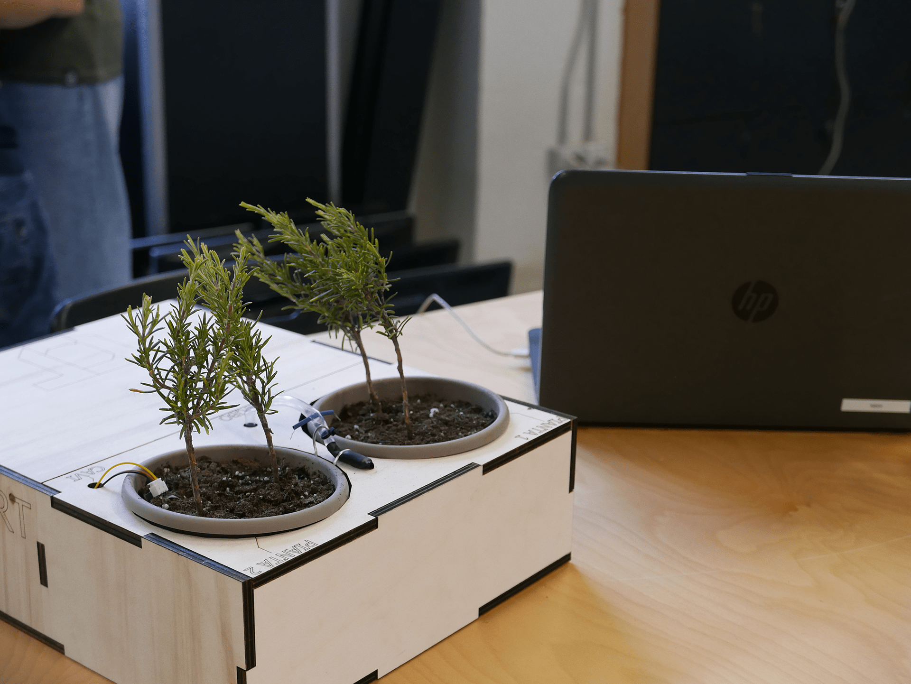

<h1>
	green_office - developed <a href="https://fondazioneedulife.github.io/green-office/" target="_blank">[IT]</a>
</h1>

## System description 

**green_office** is a project thought to save our office from pollution and excessive urbanization. We want our wonderful plants to grow up and be green, even though we don't have green thumb. What is better than an automatic irrigation system to make them be every day greener than the day before?

We would like to check if they need water when we're on holiday too (we don't want them to die), we need to be able to control our automatic irrigation system remotely.

But wait, what if someone wants to make our plants die? We'd cry :'(

Solution: it's necessary to implement a security system in our IoT project! :D

## What we developed
The system collects acquired data (humidity for example) in a DB through NodeRED and Raspberry Pi.

More specifically, 
1. acquires data from the sensors (e.g. humidity) to check the health status of the plants,
2. controls (the actuators of) the irrigation system,
3. allows the user to remotely (and super-securely) control the status of the system, and plants.

You can find the full repo [here](https://github.com/v-research/green_office).

## Who developed it
V-Research in collaboration with Fabschool Verona.

## Story
In June Marco and Mattia visited a small maker fair based in [311Verona](https://311verona.com/).
There, some really young boys (8-14 y.o.) presented their great prototypes of an automated irrigation system they developed during a summer camp organised by [Fabschool](https://www.fabschool.it/).
We were impressed by the passion they put in their projects, furthermore they've been able to learn to use and program MicroBit, humidity sensors and some more hardware in just two weeks! Incredible! :o

So the challenge: we had an advanced automated irrigation system we wanted to develop and we strongly trust in education, in fact we are teacher too and we are going to lunch an online hacking course on the site [The Practical Men](http://thepracticalmen.com/) and we have a correlate [instagram page](https://www.instagram.com/the_practical_men/) that is collecting really good feedback.
We jumped at the chance and we proposed to Fabschool to collaborate and make a more advanced version of the irrigation system with the boys!

## Secure System Engineering Process
Coming soon, in the meanwhile you can give a look at our research! :)

## Final notes

Please, remember that plants are living things and friend of us.

For more details please send an email to mattia@v-research.it
